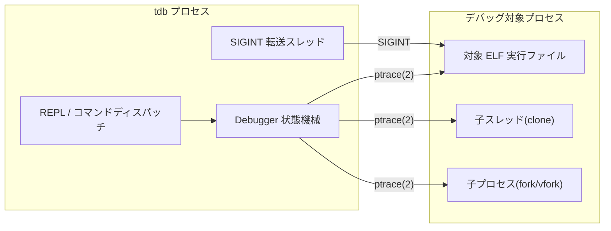
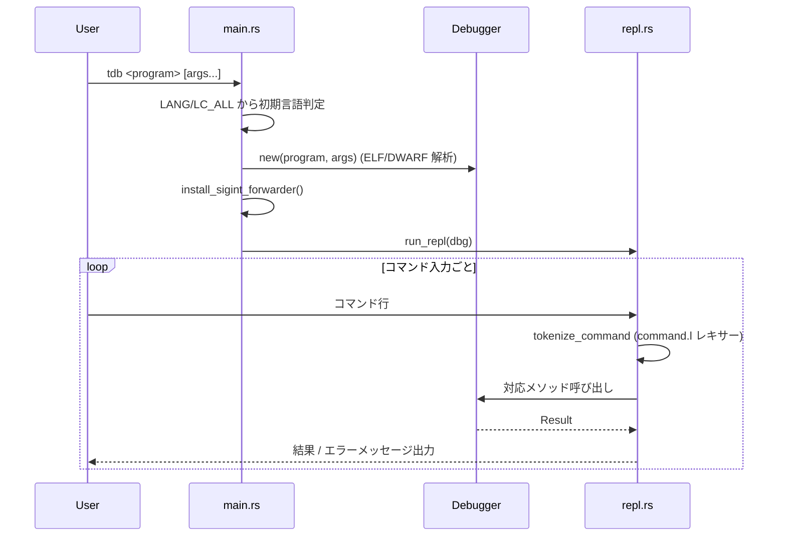
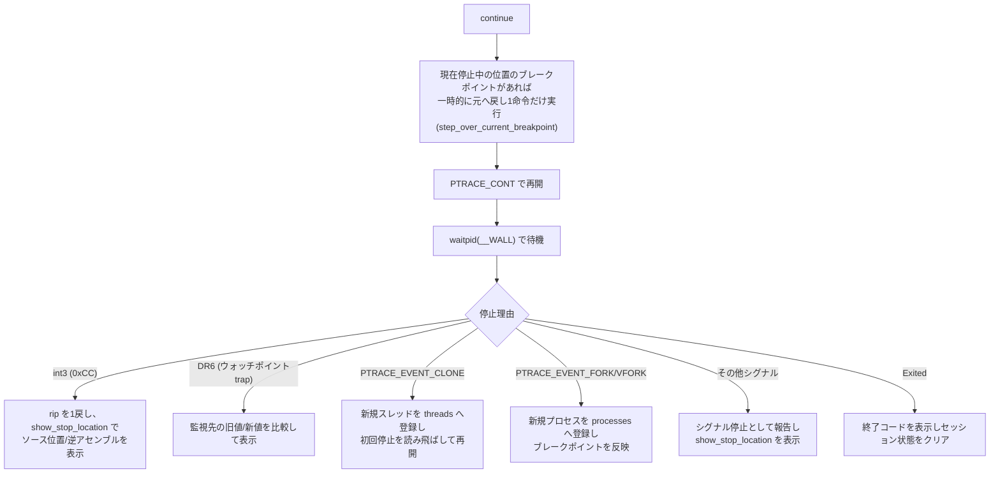
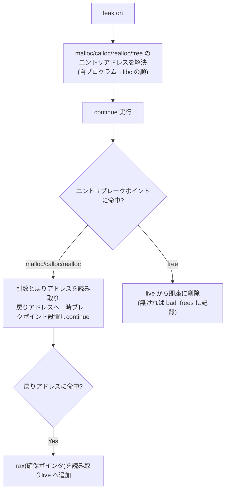

# tdb 基本設計書

本書は [要件定義書](要件定義書.md) の要件を実現するための、tdb の
アーキテクチャ・モジュール構成・主要データ構造・処理方式を定義する。
個々の処理の内部アルゴリズムは [詳細処理手順書](詳細処理手順書.md) を参照。

## 1. システム構成

tdb は単一の実行バイナリであり、外部プロセスとして GUI/デーモン等は
持たない。実行時には以下の2プロセスから構成される。



tdb プロセスは `fork(2)` でデバッグ対象を起動し、子プロセス側で
`PTRACE_TRACEME` の後 `execv` する。以降、親プロセス(tdb 本体)が
`waitpid`/`ptrace` を通じて全ての制御を行う。

## 2. モジュール構成

`src/` 配下のモジュールと責務は以下の通り。

| モジュール | 行数目安 | 責務 |
| --- | --- | --- |
| `main.rs` | 46 | エントリポイント。引数解析、初期言語判定、`Debugger` 生成、SIGINT転送スレッド起動、REPL 起動。 |
| `repl.rs` | 458 | REPL ループとコマンドディスパッチ。コマンド行の字句分割(`command.l` 生成レキサー)、各コマンドの引数解釈、`Debugger` の対応メソッド呼び出し、`print`/`set`/`watch`/`x` 等の引数固有ロジック。 |
| `debugger.rs` | 2926 | 中核。`Debugger` 構造体と、実行制御・ブレークポイント・ウォッチポイント・スレッド/プロセス管理・スタック表示・レジスタ/メモリアクセス・変数解決・メモリリーク追跡フックのほぼ全ロジック。 |
| `breakpoint.rs` | 85 | `Breakpoint`(ソフトウェアブレークポイント、`int3` パッチ)の有効化/無効化/複数プロセスへのインストール。 |
| `leak.rs` | 86 | メモリリーク追跡用の状態(`LeakTracker`)とデータ型(`AllocFn`/`LiveAlloc`/`PendingCall`)。フック自体は `debugger.rs` 側に実装。 |
| `elf_info.rs` | 102 | ELF (`.symtab`/`.dynsym`) からの関数シンボル読み取りと、アドレス⇔シンボルの相互解決 (`find_by_addr`/`find_by_name`)。 |
| `dwarf_info.rs` | 606 | DWARF (`.debug_info`/`.debug_line`) の解析。行番号テーブル、関数(`DW_TAG_subprogram`)・変数(`DW_TAG_variable`/`DW_TAG_formal_parameter`)・型(構造体/共用体/配列/ポインタ/基本型)の解決。 |
| `expr.rs` | 299 | 式評価。`RawExpr`(構文木)を `eval_ast` で実際の値(レジスタ/メモリ/変数の読み書き)へ評価する。構造体/配列の整形表示、型ヒント付き `print` 結果の構築。 |
| `expr.l` / `expr.y` | 23 / 87 | `print`/`set`/`watch`/`x` が使う式の字句規則・LALR 文法規則(grmtools)。ビルド時に `build.rs` がパーサー/レキサーを生成する。 |
| `command.l` | 3 | REPL のコマンド行を空白区切りで字句分割するためだけの、文法を伴わない単体レキサー。 |
| `registers.rs` | 285 | `ptrace(PTRACE_GETREGS/GETFPREGS/...)` のラッパー、レジスタ名⇔値の相互変換、x87 拡張精度⇔`f64` 変換、レジスタダンプの整形。 |
| `disasm.rs` | 73 | `iced-x86` を使った逆アセンブル(1命令/複数命令)、プロローグのヒューリスティック判定(DWARF が無い場合の `break <func>` 補完に使用)。 |
| `build.rs` | 54 | ビルド時コード生成。`expr.l`/`expr.y` から式パーサーを、`command.l` からコマンド行レキサーを `cfgrammar`/`lrlex`/`lrpar` (grmtools) で生成する。 |
| `locales/app.yml` | - | `rust-i18n` 用の日本語/英語メッセージ定義(`_version: 2` 形式)。 |

## 3. 主要データ構造

### 3.1 `Debugger` 構造体 (`debugger.rs`)

デバッガのセッション状態を単一の構造体に集約する(シングルスレッドの
所有者モデル。`&mut self` を通じてのみ状態変更する)。

| フィールド | 型 | 役割 |
| --- | --- | --- |
| `program` / `args` | `PathBuf` / `Vec<String>` | 起動対象と引数。 |
| `elf` / `dwarf` | `ElfInfo` / `DwarfInfo` | 起動時に一度だけ解析する静的情報。 |
| `pid` | `Option<Pid>` | メインプロセスの pid。未起動時 `None`。 |
| `load_bias` | `u64` | PIE の実行時ロードベースアドレス。 |
| `breakpoints` | `HashMap<u64, Breakpoint>` | 実行時アドレス→ソフトウェアブレークポイント実体(1アドレス1個)。 |
| `pending_breaks` | `Vec<String>` | 起動前に指定された未解決のシンボル名ブレークポイント。 |
| `bp_ids` | `HashMap<u32, u64>` | ユーザー向け通し番号→アドレス(ブレークポイント/ウォッチポイント共通の番号空間の一部)。 |
| `watchpoints` | `[Option<Watchpoint>; 4]` | DR0-DR3 に対応するハードウェアウォッチポイントスロット。 |
| `wp_ids` | `HashMap<u32, usize>` | 通し番号→DR スロット番号。 |
| `threads` | `HashSet<Pid>` | 既知の全スレッド(tid)。 |
| `current_tid` | `Option<Pid>` | フォーカス中のスレッド。 |
| `thread_ids` | `HashMap<u32, Pid>` | ユーザー向けスレッド番号→tid。 |
| `pending_initial_stop` | `HashSet<Pid>` | 自動アタッチ直後、初回停止をまだ読み飛ばしていないスレッド集合。 |
| `locked_tid` | `Option<Pid>` | `lock` 中のスレッド(`None` なら未ロック)。 |
| `processes` | `HashSet<Pid>` | 独立したアドレス空間を持つプロセスリーダー(メイン+`fork`由来子)。 |
| `print_pretty` / `print_elements` | `bool` / `Option<usize>` | `set print` 設定。 |
| `leak` | `LeakTracker` | メモリリーク追跡状態。 |
| `skip_target` | `Option<u64>` | `nexti`/`up` が待っている一時停止アドレス(リーク追跡フックとの競合回避に使用)。 |
| `exited` | `bool` | デバッグ対象が終了済みかどうか。 |

補助構造体 `Watchpoint`(`addr`/`len`/`label`/`last_value`)は
`debugger.rs` 内に private struct として定義する。

### 3.2 `Breakpoint` (`breakpoint.rs`)

`addr` / `enabled` / `orig_byte`(private)を持つ。`enable`/`disable` は
自分自身の有効フラグを管理し、`install_in`/`remove_from` は状態を持たず
任意の `pid` のメモリへ冪等に書き込む(`fork` 由来の複数プロセスへの反映用)。

### 3.3 `LeakTracker` 関連 (`leak.rs`)

`AllocFn`(`Malloc`/`Calloc`/`Realloc`/`Free`)、`LiveAlloc`(`size`/`func`/
`call_site`)、`PendingCall`(エントリ捕捉〜戻り値捕捉の間の一時情報)、
`LeakTracker`(`enabled`/`entries`/`pending`/`live`/`total_allocs`/
`total_frees`/`bad_frees`/`warmed_up`)。

### 3.4 `ElfInfo`/`Symbol` (`elf_info.rs`)

`Symbol { name, addr, size }` のリストとして関数シンボルのみを保持する
(`STT_FUNC`)。`find_by_addr` はアドレスを内包する(またはサイズ0シンボル
から近い範囲内の)シンボルを返し、`find_by_name` は完全一致検索を行う。

### 3.5 `DwarfInfo` 関連 (`dwarf_info.rs`)

- `LineRow`: `.debug_line` 1行分(`file`/`line`/`addr`/`is_stmt`/`end_sequence`)。
- `VarInfo`: 変数/仮引数1つ分(`name`/`type_info`/`DW_AT_location` 由来の位置情報)。
- `SubprogramInfo`: 関数1つ分(アドレス範囲、DIE ツリー内の変数群)。
- `TypeInfo`: 基本型/ポインタ/構造体/共用体/配列を表す列挙型。構造体/共用体は
  `MemberInfo`(`name`/`type_info`/`offset`)のリストを持つ。
- `DwarfInfo`: 上記全体を保持し、`lookup(addr)`(行番号解決)、
  `find_subprogram(addr)`、変数名からの位置・型解決 API を提供する。

### 3.6 式評価 (`expr.rs`)

- `RawExpr`: 構文解析器(`expr.y`)が組み立てる、未評価の構文木
  (`Ident`/`Num`/`Float`/`Reg`/`Unary`/`Binary`/`Deref`/`AddrOf`/`Chain` 等)。
- `Value`: 評価結果 (`Int(i64)` / `Float(f64)`)。
- `ChainStep`/`RawChainStep`: `->`/`.`/`[]` の連鎖アクセス1ステップ
  (`Field(name)` / `Index(expr)`)。
- `TypeHint`: `print` の表示形式判定に使う型情報(型名・ポインタか否か)。
- `PrintResult`: `print` の最終結果(`Text`(整形済み文字列) または
  `Value`+`Option<TypeHint>`)。

## 4. 処理方式(概要)

### 4.1 起動〜REPL



`Debugger::new` の時点でプロセスはまだ起動しない(ELF/DWARF の静的解析のみ)。
`run` コマンドで初めて `fork`+`PTRACE_TRACEME`+`execv` を行う。

### 4.2 `continue` とブレークポイント/ウォッチポイント停止



停止理由の判定・スレッド/プロセス登録・フォーカス切り替えは
[詳細処理手順書](詳細処理手順書.md) 3〜6 章を参照。

### 4.3 式評価パイプライン (`print`/`set`/`watch`/`x`)


構文解析はビルド時に `build.rs` が `expr.l`/`expr.y` から生成する
(`RecoveryKind::None` により構文エラー時の自動修復は無効化)。評価は
パース後に別途 `eval_ast` が行う(`Debugger` への参照をパーサーの
アクションへ渡す標準的な方法が不確実なため、パースと評価を分離)。

### 4.4 メモリリーク追跡フック



詳細は [詳細処理手順書](詳細処理手順書.md) 8 章を参照。

## 5. スレッド/プロセスモデル

- **スレッド (`clone(2)`)**: `PTRACE_O_TRACECLONE` により自動アタッチ。
  `threads`(全体集合)と `thread_ids`(表示用番号)で管理。ブレークポイント
  はプロセス共有メモリへのパッチのため追加作業不要だが、ウォッチポイント
  (DR0-DR7) はスレッド固有のカーネル状態のため、新規スレッド検出時に
  既存の設定を反映する。
- **プロセス (`fork(2)`/`vfork(2)`)**: `PTRACE_O_TRACEFORK`/
  `PTRACE_O_TRACEVFORK` により自動アタッチ。`processes` 集合で管理。
  各プロセスは独立したアドレス空間を持つため、ブレークポイントは
  `fork` 時点でメモリごとコピーされる分は自動反映されるが、`fork` 後の
  新規設置は既知の全プロセスへ個別にインストールする。
- **フォーカス (`current_tid`)**: レジスタ表示・`print`・`step`系・
  `backtrace`・`set` 等、単一スレッドを前提とする操作の対象。ブレーク
  ポイント/ウォッチポイントの発火で自動的に切り替わる。GDB の all-stop
  のような「発火時に他の全スレッドを強制停止」は行わない(フォーカス外は
  バックグラウンドで動き続ける簡略モデル)。
- **ロック (`locked_tid`)**: `lock <n>` 中、ロック対象以外のスレッドは
  `wait_and_report` が検出しても再開せず保留する。`unlock`(または
  ロック対象の終了)で保留分を再開する。

## 6. 外部インタフェース(コマンド一覧)

REPL が受け付ける全コマンドと実装対応は以下の通り(`repl.rs` の
`dispatch` 関数が正)。詳細な引数仕様は [README.md](../README.md)
「コマンド一覧」章を参照。

| コマンド | 短縮形 | `Debugger` 側の主な呼び出し |
| --- | --- | --- |
| `run` | `r` | `start()` |
| `break <spec>` | `b` | `break_at_spec()` |
| `info breakpoints` | `i b` | `list_breakpoints()` |
| `info watchpoints` | `i w` | `list_watchpoints()` |
| `info threads` | `i t` | `list_threads()` |
| `info registers` | `i r` | `print_regs()` |
| `thread <n>` | | `switch_thread()` |
| `thread apply all <cmd>` | | `focus_thread_for_apply()` + 再帰的 `dispatch` |
| `lock <n>` | | `lock_thread()` |
| `unlock` | | `unlock_thread()` |
| `watch ...` | | `add_watchpoint()`(`variable_address_and_size()` 経由) |
| `delete <n>` | `d` | `delete_breakpoint()`(内部でウォッチポイント判定) |
| `continue` | `c` | `cont()` |
| `stepi` | `si` | `stepi()` |
| `nexti` | `ni` | `nexti()` |
| `step` | `s` | `step_line()` |
| `next` | `n` | `next_line()` |
| `up` | | `up()` |
| `backtrace` | `bt` | `backtrace()` |
| `syms [filter]` | | `list_symbols()` |
| `lines [func]` | | `list_lines()` |
| `list [spec]` | `l` | `list_source()` |
| `leak on\|off` | | `set_leak_tracking()` |
| `leak` | | `show_leak_status()` |
| `leaks` | | `list_leaks()` |
| `print`/`print/<fmt>` | `p` | `expr::eval_typed()` |
| `show print\|locals\|args\|globals` | | `list_locals()`/`list_args()`/`list_globals()` 等 |
| `set print pretty\|elements` | | `set_print_pretty()`/`set_print_elements()` |
| `set <target>=<式>` | | `expr::eval()` + `write_mem()`/`set_reg()`/`write_member_chain()`/`write_variable()` |
| `x/<n> <addr\|$reg>` | | `read_mem()` |
| `kill` | `k` | `kill()` |
| `help` | `h`,`?` | (i18n の `help` メッセージをそのまま出力) |
| `lang <en\|ja>` | | `rust_i18n::set_locale()` |
| `quit` | `q`,`exit` | `kill()`(実行中なら)後 REPL 終了 |

## 7. 多言語対応の設計

- `locales/app.yml` に `_version: 2` 形式で日本語(`ja`)/英語(`en`)の
  訳文を1ファイルにまとめる。
- コード側は `t!("キー", 名前 = 値, ...)` マクロで参照し、`%{名前}`
  プレースホルダに置換する(書式指定子 `t!(..., 値 : {:#x})` も可)。
- 表示言語は起動時に `LANG`/`LC_ALL` から推測し、実行中は `lang`
  コマンド(`rust_i18n::set_locale`)で切り替える。
- `%{名前}` に渡す値のうち、識別子(関数名・変数名・レジスタ名等)や
  コマンド構文そのもの(`on`/`off` 等)は翻訳せず、両言語で共通表示する。
- ソースコード中のコメントや `unreachable!()` 等、開発者向けの内部
  エラーは翻訳対象外。

## 8. エラー処理方針

- `Debugger` の各操作 API は `anyhow::Result<T>` を返す。REPL 側
  (`repl.rs::dispatch`)が呼び出しをまとめて受け、`Err` の場合は
  `repl.error_prefix` メッセージ経由で内容を表示し、REPL ループは
  継続する(1コマンドのエラーでセッション全体を落とさない)。
- 式評価の構文エラーは `lrpar` の `RecoveryKind::None` により自動修復
  せず、そのままエラーとして呼び出し元へ伝播する。
- ベストエフォートで許容する失敗(フォーカス外スレッド/停止していない
  プロセスへの `PTRACE_POKEUSER` 等)は、呼び出し側で明示的に無視する
  (`let _ = ...`)。

## 9. ビルド構成

- `Cargo.toml` の `[build-dependencies]` に `cfgrammar`/`lrlex`/`lrpar`
  を持ち、`build.rs` が以下の2種のレキサー/パーサーをビルド時生成する。
  1. `expr.l`+`expr.y` → 式パーサー(`CTLexerBuilder` + `lrpar_config`、
     `RecoveryKind::None`、`allow_missing_terms_in_lexer(true)` で
     `%prec` 専用疑似トークン `UMINUS` を許容)。
  2. `command.l` → コマンド行レキサー(文法を伴わない単体レキサー)。
- 生成コードは `lrlex_mod!`/`lrpar_mod!` マクロ(`repl.rs`/`expr.rs`)で
  取り込む。

## 10. ディレクトリ構成

```
tdb-linux/
├── Cargo.toml / Cargo.lock
├── build.rs              # grmtools コード生成
├── src/
│   ├── main.rs            # エントリポイント
│   ├── repl.rs             # REPL・コマンドディスパッチ
│   ├── debugger.rs          # 中核ロジック
│   ├── breakpoint.rs
│   ├── leak.rs
│   ├── elf_info.rs
│   ├── dwarf_info.rs
│   ├── expr.rs / expr.l / expr.y
│   ├── command.l
│   ├── registers.rs
│   └── disasm.rs
├── locales/app.yml        # i18n メッセージ
├── examples/               # 検証用サンプル C プログラム
└── docs/                   # 本ドキュメント一式
```
